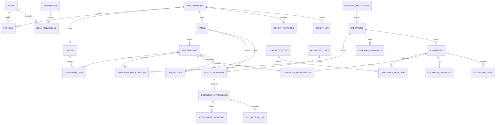

# Arquitetura PostgreSQL/Supabase

> Estado atual aprovado: schema executado e validado no Supabase local, com migrations até `014`. O frontend usa Supabase para Auth/MFA, profiles/permissions, todos os módulos de negócio, Administração de Usuários e Administração de Catálogos. A Fase A de arquivos usa Storage privado.

## Visão geral

O modelo usa UUIDs, `snake_case`, `timestamptz` para eventos, `date` para datas civis, `numeric(15,2)` para dinheiro, `numeric(15,4)` para hectares e `numeric(5,2)` para percentuais. As entidades editáveis mantêm autoria, timestamps, `version` e soft delete. `status` representa estado de negócio; `deleted_at` representa remoção lógica.

Supabase Auth continua como fonte exclusiva de credenciais. A arquitetura é multi-tenant-ready, embora a V1 opere inicialmente com uma única organização. Cada `profile` possui exatamente um `organization_id NOT NULL`, sem troca de organização e sem `organization_memberships`. Autorização efetiva é `profile → role_permissions → permissions`, complementada por isolamento de organização em RLS.

Nos módulos já migrados, a arquitetura de acesso aprovada é `Component → Service → Repository → Supabase`. Nenhum componente consulta tabelas diretamente, e RLS permanece a segurança efetiva mesmo quando ações sem permission são ocultadas na UI.

## Estado da integração do frontend

| Fonte atual | Escopo |
|---|---|
| Supabase | Auth/MFA, profiles/permissions, Proprietários, Fazendas, Matrículas, OwnershipLinks, Documentos, referências de arquivos, CAR, Operações, Garantias, itens de garantia, Consulta Geral, Dashboard, Relatórios, Administração de Usuários e Administração de Catálogos |

Não existe dual-write. Consulta Geral, Dashboard, Relatórios e os Drawers imobiliários consomem as entidades e relações reais. Dashboard e Relatórios derivam seus indicadores em camadas agregadoras de repositories com consultas paralelas; valores financeiros só são consultados quando as permissions correspondentes estão presentes.

Supabase/PostgreSQL é a única fonte de dados de negócio. A infraestrutura frontend de MockStore, selectors e seeds demonstrativos foi removida após a conclusão da migração.

Administração de Usuários e Administração de Catálogos estão concluídas no escopo atual. A primeira usa Edge Function para operações administrativas privilegiadas; a segunda usa repository Supabase e RLS com `catalogs.manage`, sem `service_role` no frontend.

## Migrations e dependências

| Ordem | Arquivo | Responsabilidade |
|---|---|---|
| 1 | `202608270001_core_identity.sql` | organização, perfis, roles, permissions e helpers comuns |
| 2 | `202608270002_real_estate.sql` | proprietários, fazendas, matrículas e vínculos de propriedade |
| 3 | `202608270003_operations_guarantees.sql` | instituições, operações, garantias e relações N:N |
| 4 | `202608270004_documents_car.sql` | documentos, metadados de arquivos, acessos e CAR |
| 5 | `202608270005_reports_audit.sql` | auditoria e metadados de relatórios |
| 6 | `202608270006_rls_permissions.sql` | grants, RLS, transições protegidas e restauração controlada |
| 7 | `202608280007_allow_attachment_path_validation.sql` | ajuste da validação de referências de arquivo |
| 8 | `202608280008_harden_authenticated_table_grants.sql` | endurecimento dos grants para usuários autenticados |
| 9 | `202608280009_expose_current_user_permissions.sql` | função segura para carregar permissions do usuário atual |
| 10 | `202609010010_transactional_operations_guarantees.sql` | RPCs atômicos para Operações, Garantias, relações N:N e financeiro |
| 11 | `202609030011_user_administration_support.sql` | alteração transacional de profiles, proteção do último gestor de usuários e eventos administrativos |
| 12 | `202609030012_catalog_administration.sql` | permission administrativa e RLS tenant-aware para instituições financeiras, tipos de garantia e tipos de documento |
| 13 | `202609040013_hybrid_document_storage.sql` | localizações 1:N, bucket privado, Storage RLS e ciclo compensável de upload/download |
| 14 | `202609040014_files_manage_attachment_visibility.sql` | leitura de metadados para gestão independente de acesso ao conteúdo |

A ordem é obrigatória: cada migration referencia somente objetos criados anteriormente, salvo `auth.users`, fornecido pelo Supabase.

## Catálogo de tabelas

| Área | Tabelas | Papel principal |
|---|---|---|
| Identidade | `organizations`, `profiles`, `roles`, `permissions`, `role_permissions` | tenant, perfil e autorização granular |
| Imóveis | `owners`, `farms`, `registrations`, `ownership_links` | cadastro rural e titularidade |
| Operações | `financial_institutions`, `operations`, `operation_registrations`, `operation_financials` | operação N:N com matrículas e valores isolados |
| Garantias | `guarantees`, `guarantee_types`, `guarantee_type_links`, `guarantee_registrations`, `guarantee_financials`, `guarantee_items` | garantias multi-tipo e multi-matrícula |
| Documentos | `document_types`, `rural_documents`, `document_attachments`, `attachment_locations`, `file_access_log` | documentos, anexos lógicos, localizações físicas e acessos |
| CAR | `car_records` | histórico de CAR por fazenda/matrícula |
| Governança | `audit_log`, `report_templates`, `report_log` | trilha imutável e geração de relatórios |

## Relacionamentos e cardinalidades

## Constraints e integridade

- CPF/CNPJ de proprietário é normalizado e único por `(organization_id, document_number)`; aceita 11 ou 14 dígitos. CNPJ identifica o próprio tenant e permanece globalmente único em `organizations`.
- Matrícula é única por `(organization_id, farm_id, number)`; CAR por `(organization_id, car_number)`; operação por `(organization_id, operation_number)`.
- Unicidades das relações N:N e dos registros principais também incluem `organization_id`; somente UUIDs técnicos e catálogos globais de roles/permissions permanecem globalmente únicos.
- FKs compostas por `organization_id` impedem relações entre organizações. Documento/CAR com matrícula exige que ela pertença à fazenda informada.
- Áreas, valores e quantidades não podem ser negativos; percentual informado deve estar em `(0, 100]`; datas finais não antecedem iniciais.
- A soma de percentuais ativos de titularidade não pode exceder 100%. Um advisory lock transacional por matrícula serializa a validação concorrente e a atualização exclui o próprio vínculo da soma.
- Índices parciais garantem no máximo uma matrícula principal por operação e um tipo principal por garantia.
- Matrícula de garantia deve existir entre as matrículas da operação. A relação da operação não pode ser removida/alterada enquanto uma garantia depender dela.
- FKs históricas usam `ON DELETE RESTRICT`; relações técnicas N:N podem ser removidas explicitamente, mas não por cascade.
- `rural_documents_with_validity` deriva `active`, `expiring`, `expired` e `inactive`; esses estados de validade não são persistidos.
- `file_path` e referências de localização rejeitam padrões explícitos de credencial; checksums usam SHA-256 hexadecimal.
- Object keys Cloud seguem `organization/document/attachment/object`, formadas somente por UUIDs. Bucket, object key e referência externa são mutuamente coerentes com o storage type.

## RLS e segurança

Todas as 28 tabelas empresariais/governança têm RLS habilitado, além das policies específicas de `storage.objects`. `anon` não recebe acesso. Policies separam `SELECT`, `INSERT`, `UPDATE` e, apenas nas relações técnicas, `DELETE`. Toda tabela empresarial exige simultaneamente a organização do profile ativo e a permission granular correspondente. Valores de `operation_financials` e `guarantee_financials` exigem `financial.read`/`financial.write`; ocultá-los apenas no React não é aceito. UUID ou object key conhecido nunca substitui autorização.

`audit_log` é somente leitura para `audit.read`; eventos de `operation_financials` e `guarantee_financials` exigem adicionalmente `financial.read`. `file_access_log` só é escrito pela função controlada `log_file_access`; catálogos de roles/permissions exigem `permissions.manage`, enquanto os catálogos empresariais exigem `catalogs.manage` para escrita. Nenhuma função expõe `service_role`.

Os roles genéricos `admin`, `manager`, `operator` e `viewer` são configuração inicial, sem usuários ou dados pessoais. Permissões financeiras e de exportação permanecem entradas independentes do catálogo.

## Bootstrap da V1

1. A organização inicial é criada durante o provisionamento, por ambiente administrativo seguro do Supabase.
2. O primeiro usuário é criado ou convidado administrativamente em Supabase Auth; não existe cadastro público.
3. Um `profile` é criado com `organization_id` obrigatório apontando para a organização provisionada.
4. O role `admin` é atribuído ao primeiro profile.
5. Os demais usuários são posteriormente convidados pelo Admin e associados à mesma organização na V1.

O papel `authenticated` não possui `INSERT` em `organizations`. Não existe fluxo React de bootstrap, signup público, criação de organização ou troca de tenant. Convites cotidianos são iniciados pela área administrativa e executados exclusivamente pela Edge Function autorizada.

## Administração de usuários

A rota `/administracao/usuarios` usa o fluxo `Component → Service → Repository → Edge Function → Supabase Admin API/PostgreSQL`. O navegador envia somente a sessão do usuário; `service_role` permanece exclusivamente no runtime da Edge Function. A função valida a sessão no Auth, exige `users.manage`, deriva `organization_id` do profile ativo e rejeita qualquer tenant recebido no payload.

Convites e recuperações usam `APP_PUBLIC_URL`, e CORS usa `ALLOWED_ORIGINS`; nenhuma URL de implantação é compilada no frontend. A listagem cruza profiles do tenant com metadados não sensíveis do Auth e devolve apenas e-mail, datas de acesso e a situação booleana do MFA. Senhas, tokens, sessões e secrets TOTP nunca são retornados.

Inativação preserva o profile e a auditoria, remove o acesso lógico via `profile.status`/RLS e aplica banimento no Supabase Auth. Reativação reverte ambos. Alterações de profile são transacionais no PostgreSQL e um advisory lock impede que operações concorrentes removam o último profile ativo cujo role concede `users.manage`.

Revogação granular de todas as sessões de outro usuário não foi exposta: a Admin API disponível exige o JWT da própria sessão para logout global. Não há obtenção ou armazenamento inseguro de tokens de terceiros. Em produção, `ALLOWED_ORIGINS` deve conter somente origens HTTPS e os limites distribuídos devem ser aplicados no gateway/plataforma; o limitador em memória da função é apenas uma barreira complementar por instância.

## Administração de catálogos

A rota `/administracao/catalogos` administra `financial_institutions`, `guarantee_types` e `document_types` pela cadeia `Component → Service → Repository → Supabase`. Os três catálogos são delimitados por `organization_id`; nomes e códigos podem se repetir entre organizações, mas respeitam as unicidades compostas dentro do tenant.

Somente `catalogs.manage` autoriza criação, edição, inativação e reativação. As permissions de leitura dos módulos continuam permitindo resolver opções e referências históricas. Novos vínculos oferecem itens ativos; itens inativos já referenciados permanecem consultáveis e exibem seus nomes porque as FKs usam `ON DELETE RESTRICT`. A interface não oferece exclusão física. Os triggers existentes registram criação, edição e mudanças de situação no `audit_log`.

## Concorrência, soft delete e auditoria

Triggers atualizam `updated_at`, `updated_by` e incrementam `version`. Updates usam `WHERE id = :id AND version = :expected_version`; zero linhas significa conflito, nunca sobrescrita silenciosa. Os RPCs de titularidade e os RPCs transacionais `save_operation_transactional`/`save_guarantee_transactional` aplicam essa regra.

Criação e atualização de Operações e Garantias são fronteiras transacionais únicas no PostgreSQL. Entidade principal, valores financeiros e relações N:N são confirmados ou revertidos juntos. As funções usam `SECURITY INVOKER`, portanto grants, RLS, permissions, triggers de auditoria e regras cross-tenant continuam aplicáveis dentro da transação; exceções também revertem os eventos de auditoria produzidos pela tentativa.

Queries normais/RLS ignoram `deleted_at IS NOT NULL`. Remoção e restauração controladas usam `soft_delete_record` e `restore_soft_deleted_record`, com whitelist de tabelas, organization, permission e versão esperada. Restauração da própria organização fica reservada ao bootstrap/operador privilegiado, pois inativá-la ou removê-la bloqueia corretamente os profiles do tenant. `status = inactive` continua independente.

Triggers gravam INSERT/UPDATE/INACTIVATE/CLOSE/CANCEL/SOFT_DELETE/RESTORE em `audit_log`. CPF/CNPJ, telefones, e-mails, notas sensíveis, nomes/caminhos de arquivos e outros dados pessoais são redigidos. Alterações de `amount` permanecem como `old → new` para rastreabilidade, mas seus eventos só são consultáveis com `audit.read` e `financial.read`. Acessos a arquivo ficam exclusivamente em `file_access_log`.

## Arquivos

`document_attachments` representa o arquivo lógico; `attachment_locations` permite múltiplas localizações físicas `supabase_storage`, `network_share` ou `external`. As colunas de localização legadas em `document_attachments` foram preservadas e sincronizadas com uma localização primária para compatibilidade.

Na Fase A, o bucket `rural-documents` é privado e aceita até 20 MB nos MIME documentados. `document-files` deriva o tenant da sessão, exige `files.manage` para preparar/finalizar/remover e `files.read` para download. O navegador envia bytes diretamente com autorização temporária; a função baixa o objeto somente na finalização para conferir MIME/tamanho e calcular SHA-256. URLs assinadas duram 60 segundos, usam origem configurada por ambiente e não são persistidas.

Os estados `uploading → active` e `active → removing → inactive` registram consistência. Falhas após envio removem o objeto quando seguro e marcam metadados como `failed`/inativos; o fluxo é idempotente na finalização. `file_access_log` registra upload, download/view e remoção de localização sem URL, token, secret ou caminho interno. Referências `network_share` permanecem válidas, mas o navegador não tenta abrir SMB. Backup de Storage continua independente do backup PostgreSQL.

## Relatórios

`report_templates` e `report_log` permanecem vinculados à organização. `configuration` e `included_sections` usam JSONB para seções configuráveis. As exportações PDF e XLSX seguem React → Service → Repository → Edge Function → Auth/RLS/permissions → consulta → geração → resposta temporária. A organização autenticada forma o emitente/cabeçalho. Valores financeiros exigem simultaneamente `reports.financial` e `financial.read`. `report_log` registra autor, filtros, seções, formato, quantidade de linhas e páginas/abas e horários, sem armazenar o arquivo permanentemente. CSV permanece apenas como formato previsto pelo schema.

A pré-visualização dos sete relatórios consulta os repositories Supabase reais e calcula linhas, filtros e totais de forma derivada. A exportação repete a consulta na Edge Function sob a sessão do usuário, deriva o tenant do profile, revalida `reports.read`, `reports.generate` e `reports.export` e nunca aceita `organization_id` do navegador. O XLSX contém uma aba `Resumo` e uma aba principal tipada; datas, números e valores monetários permanecem valores nativos. A resposta usa `Cache-Control: private, no-store`; nenhum objeto de Storage ou URL pública permanente é criado.

## Navegação por IDs

Os módulos migrados usam deep links por UUID (`/fazendas?open=<uuid>`, `/matriculas?open=<uuid>`, `/proprietarios?open=<uuid>`, `/documentos?open=<uuid>`, `/car?open=<uuid>` e Operações/Garantias pelos parâmetros `id`/`garantia`). Conhecer o UUID não concede acesso: RLS continua obrigatório.

## Ambientes e recuperação

- `development`: apenas dados fictícios; `production`: dados reais; `staging` é recomendado antes da implantação.
- Nunca colocar dados reais em seeds, Git, fixtures, screenshots ou console.
- As organizações fictícias inativadas existentes são somente resíduos do ambiente local de teste e não representam organizações de negócio.
- Antes da entrada de dados reais, o banco de desenvolvimento poderá ser recriado integralmente pelas migrations, removendo resíduos e comprovando a reprodutibilidade do schema.
- PostgreSQL e arquivos precisam de backups automáticos, retenções separadas e testes periódicos de restauração. Backup sem restore testado não é considerado confiável.

## Acesso remoto previsto

A implantação remota futura manterá o frontend servido exclusivamente por HTTPS, comunicando-se com Supabase Cloud por chaves publicáveis e sessão autenticada. Operações privilegiadas ou que exijam segredo permanecerão em backend/Edge Functions; `service_role`, credenciais PostgreSQL e demais secrets nunca serão enviados ao navegador.

URLs, origens permitidas e callbacks serão configurados por ambiente, sem `localhost` ou IP fixo no bundle de produção. RLS, permissions e `organization_id` continuarão sendo a fronteira efetiva de segurança no banco.

## Pendências explícitas

- **CONCLUÍDO — PDF real:** geração server-side, download direto temporário, paginação, cabeçalho da organização e `report_log` estão implementados para os sete relatórios.
- **CONCLUÍDO — XLSX real:** geração server-side, download direto temporário, metadados, resumo, dados tipados e `report_log` estão implementados para os sete relatórios.
- **CONCLUÍDO — arquivos Fase A:** upload real no Storage privado, download por URL curta, SHA-256, localizações 1:N, RLS, auditoria de acesso e compensação básica.
- **PENDENTE — arquivos Fase B:** File Gateway, SMB, sincronização/segunda cópia no servidor Windows/HD, antivírus, retenção e migração de legados.
- **PENDENTE — hardening final:** revisão de produção de headers, rate limits distribuídos, secrets, observabilidade, backups e recuperação.
- **PENDENTE — homologação:** testes integrados em staging, validação do negócio e aceite formal antes do uso com dados reais.
- **PENDENTE — CAB:** significado e regras não definidos; nenhum campo ou regra CAB foi cristalizado no schema.
- **PENDENTE — HP:** significado e regras não definidos; nenhum campo ou regra HP foi cristalizado no schema.
- Demais decisões abertas estão em `docs/database-open-questions.md`.
