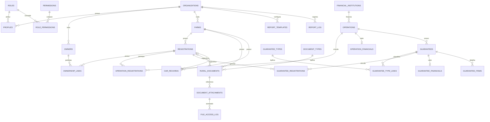

# Arquitetura PostgreSQL/Supabase

> Estado atual: schema executado e validado no Supabase local. O frontend já usa Supabase para Auth/MFA, profiles/permissions, Proprietários, Fazendas, Matrículas, OwnershipLinks, Documentos, referências de arquivos, CAR, Operações, Garantias e itens de garantia. Dashboard e Relatórios permanecem temporariamente no MockStore.

## Visão geral

O modelo usa UUIDs, `snake_case`, `timestamptz` para eventos, `date` para datas civis, `numeric(15,2)` para dinheiro, `numeric(15,4)` para hectares e `numeric(5,2)` para percentuais. As entidades editáveis mantêm autoria, timestamps, `version` e soft delete. `status` representa estado de negócio; `deleted_at` representa remoção lógica.

Supabase Auth continua como fonte exclusiva de credenciais. A arquitetura é multi-tenant-ready, embora a V1 opere inicialmente com uma única organização. Cada `profile` possui exatamente um `organization_id NOT NULL`, sem troca de organização e sem `organization_memberships`. Autorização efetiva é `profile → role_permissions → permissions`, complementada por isolamento de organização em RLS.

Nos módulos já migrados, a arquitetura de acesso aprovada é `Component → Service → Repository → Supabase`. Nenhum componente consulta tabelas diretamente, e RLS permanece a segurança efetiva mesmo quando ações sem permission são ocultadas na UI.

## Estado da integração do frontend

| Fonte atual | Escopo |
|---|---|
| Supabase | Auth/MFA, profiles/permissions, Proprietários, Fazendas, Matrículas, OwnershipLinks, Documentos, referências de arquivos, CAR, Operações, Garantias e itens de garantia |
| MockStore | Dashboard e Relatórios |

Não existe dual-write. Consulta Geral e os Drawers imobiliários consomem também as relações reais de Operações e Garantias. Dashboard e Relatórios continuam isolados no MockStore até suas migrações específicas.

## Migrations e dependências

| Ordem | Arquivo | Responsabilidade |
|---|---|---|
| 1 | `202608270001_core_identity.sql` | organização, perfis, roles, permissions e helpers comuns |
| 2 | `202608270002_real_estate.sql` | proprietários, fazendas, matrículas e vínculos de propriedade |
| 3 | `202608270003_operations_guarantees.sql` | instituições, operações, garantias e relações N:N |
| 4 | `202608270004_documents_car.sql` | documentos, metadados de arquivos, acessos e CAR |
| 5 | `202608270005_reports_audit.sql` | auditoria e metadados de relatórios |
| 6 | `202608270006_rls_permissions.sql` | grants, RLS, transições protegidas e restauração controlada |
| 7 | `202608280007_allow_attachment_path_validation.sql` | ajuste da validação de referências de arquivo |
| 8 | `202608280008_harden_authenticated_table_grants.sql` | endurecimento dos grants para usuários autenticados |
| 9 | `202608280009_expose_current_user_permissions.sql` | função segura para carregar permissions do usuário atual |

A ordem é obrigatória: cada migration referencia somente objetos criados anteriormente, salvo `auth.users`, fornecido pelo Supabase.

## Catálogo de tabelas

| Área | Tabelas | Papel principal |
|---|---|---|
| Identidade | `organizations`, `profiles`, `roles`, `permissions`, `role_permissions` | tenant, perfil e autorização granular |
| Imóveis | `owners`, `farms`, `registrations`, `ownership_links` | cadastro rural e titularidade |
| Operações | `financial_institutions`, `operations`, `operation_registrations`, `operation_financials` | operação N:N com matrículas e valores isolados |
| Garantias | `guarantees`, `guarantee_types`, `guarantee_type_links`, `guarantee_registrations`, `guarantee_financials`, `guarantee_items` | garantias multi-tipo e multi-matrícula |
| Documentos | `document_types`, `rural_documents`, `document_attachments`, `file_access_log` | documentos configuráveis, referências e acessos |
| CAR | `car_records` | histórico de CAR por fazenda/matrícula |
| Governança | `audit_log`, `report_templates`, `report_log` | trilha imutável e geração de relatórios |

## Relacionamentos e cardinalidades

## Constraints e integridade

- CPF/CNPJ de proprietário é normalizado e único por `(organization_id, document_number)`; aceita 11 ou 14 dígitos. CNPJ identifica o próprio tenant e permanece globalmente único em `organizations`.
- Matrícula é única por `(organization_id, farm_id, number)`; CAR por `(organization_id, car_number)`; operação por `(organization_id, operation_number)`.
- Unicidades das relações N:N e dos registros principais também incluem `organization_id`; somente UUIDs técnicos e catálogos globais de roles/permissions permanecem globalmente únicos.
- FKs compostas por `organization_id` impedem relações entre organizações. Documento/CAR com matrícula exige que ela pertença à fazenda informada.
- Áreas, valores e quantidades não podem ser negativos; percentual informado deve estar em `(0, 100]`; datas finais não antecedem iniciais.
- A soma de percentuais ativos de titularidade não pode exceder 100%. Um advisory lock transacional por matrícula serializa a validação concorrente e a atualização exclui o próprio vínculo da soma.
- Índices parciais garantem no máximo uma matrícula principal por operação e um tipo principal por garantia.
- Matrícula de garantia deve existir entre as matrículas da operação. A relação da operação não pode ser removida/alterada enquanto uma garantia depender dela.
- FKs históricas usam `ON DELETE RESTRICT`; relações técnicas N:N podem ser removidas explicitamente, mas não por cascade.
- `rural_documents_with_validity` deriva `active`, `expiring`, `expired` e `inactive`; esses estados de validade não são persistidos.
- `file_path` rejeita padrões explícitos de credencial em URL/query string; checksum, quando informado, tem formato SHA-256 hexadecimal.

## RLS e segurança

Todas as 27 tabelas têm RLS habilitado. `anon` não recebe acesso. Policies separam `SELECT`, `INSERT`, `UPDATE` e, apenas nas relações técnicas, `DELETE`. Toda tabela empresarial exige simultaneamente a organização do profile ativo e a permission granular correspondente. Valores de `operation_financials` e `guarantee_financials` exigem `financial.read`/`financial.write`; ocultá-los apenas no React não é aceito. UUID conhecido nunca substitui autorização.

`audit_log` é somente leitura para `audit.read`; eventos de `operation_financials` e `guarantee_financials` exigem adicionalmente `financial.read`. `file_access_log` só é escrito pela função controlada `log_file_access`; catálogos de permissão exigem `permissions.manage`. Nenhuma função expõe `service_role`.

Os roles genéricos `admin`, `manager`, `operator` e `viewer` são configuração inicial, sem usuários ou dados pessoais. Permissões financeiras e de exportação permanecem entradas independentes do catálogo.

## Bootstrap da V1

1. A organização inicial é criada durante o provisionamento, por ambiente administrativo seguro do Supabase.
2. O primeiro usuário é criado ou convidado administrativamente em Supabase Auth; não existe cadastro público.
3. Um `profile` é criado com `organization_id` obrigatório apontando para a organização provisionada.
4. O role `admin` é atribuído ao primeiro profile.
5. Os demais usuários são posteriormente convidados pelo Admin e associados à mesma organização na V1.

O papel `authenticated` não possui `INSERT` em `organizations`. Nenhum fluxo React de bootstrap, convite ou troca de tenant faz parte deste pacote.

## Concorrência, soft delete e auditoria

Triggers atualizam `updated_at`, `updated_by` e incrementam `version`. Repositórios futuros devem executar updates com `WHERE id = :id AND version = :expected_version`; zero linhas significa conflito, nunca sobrescrita silenciosa. Os RPCs de titularidade já aplicam essa regra.

Queries normais/RLS ignoram `deleted_at IS NOT NULL`. Remoção e restauração controladas usam `soft_delete_record` e `restore_soft_deleted_record`, com whitelist de tabelas, organization, permission e versão esperada. Restauração da própria organização fica reservada ao bootstrap/operador privilegiado, pois inativá-la ou removê-la bloqueia corretamente os profiles do tenant. `status = inactive` continua independente.

Triggers gravam INSERT/UPDATE/INACTIVATE/CLOSE/CANCEL/SOFT_DELETE/RESTORE em `audit_log`. CPF/CNPJ, telefones, e-mails, notas sensíveis, nomes/caminhos de arquivos e outros dados pessoais são redigidos. Alterações de `amount` permanecem como `old → new` para rastreabilidade, mas seus eventos só são consultáveis com `audit.read` e `financial.read`. Acessos a arquivo ficam exclusivamente em `file_access_log`.

## Arquivos

`document_attachments` armazena apenas metadados e referências para `network_share`, `supabase_storage` ou `external`. Não armazena bytes nem credenciais. O acesso futuro deve passar por uma camada autorizada (backend/Edge Function) que resolva a referência e registre `view`, `download` ou `copy_reference`. Backup dos arquivos é independente do backup PostgreSQL.

## Relatórios

`report_templates` e `report_log` permanecem vinculados à organização. `configuration` e `included_sections` usam JSONB para seções configuráveis. Formatos previstos: PDF, XLSX e CSV. Fluxo futuro: React → backend/Edge Function → Auth/RLS/permissions → consulta → template → arquivo temporário → download/impressão → expiração. Dados de `organizations` formarão o emitente/cabeçalho. Valores financeiros exigem simultaneamente `reports.financial` e `financial.read`. `report_log` registra autor, filtros, seções, formato e horários, sem armazenar o PDF permanentemente.

## Navegação por IDs

Os módulos migrados usam deep links por UUID (`/fazendas?open=<uuid>`, `/matriculas?open=<uuid>`, `/proprietarios?open=<uuid>`, `/documentos?open=<uuid>` e `/car?open=<uuid>`). Deep links dos demais módulos serão consolidados durante suas respectivas migrações. Conhecer o UUID não concede acesso: RLS continua obrigatório.

## Ambientes e recuperação

- `development`: apenas dados fictícios; `production`: dados reais; `staging` é recomendado antes da implantação.
- Nunca colocar dados reais em seeds, Git, fixtures, screenshots ou console.
- As organizações fictícias inativadas existentes são somente resíduos do ambiente local de teste e não representam organizações de negócio.
- Antes da entrada de dados reais, o banco de desenvolvimento poderá ser recriado integralmente pelas migrations, removendo resíduos e comprovando a reprodutibilidade do schema.
- PostgreSQL e arquivos precisam de backups automáticos, retenções separadas e testes periódicos de restauração. Backup sem restore testado não é considerado confiável.

## Pendências explícitas

- **PENDENTE — CAB:** significado e regras não definidos; nenhum campo ou regra CAB foi cristalizado no schema.
- **PENDENTE — HP:** significado e regras não definidos; nenhum campo ou regra HP foi cristalizado no schema.
- Demais decisões abertas estão em `docs/database-open-questions.md`.
